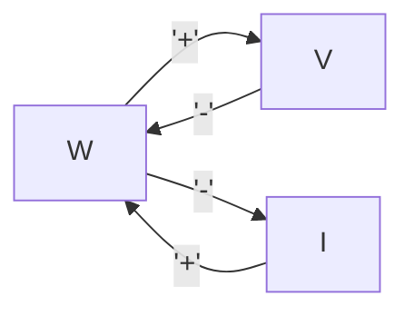
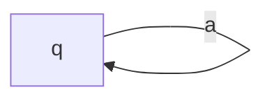
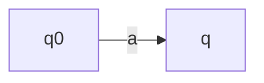

# Sistemi a transizione di stato

ID: ALF-13
Date: 26/11/2024
Status: Da revisionare

# State transistion systems

Partiamo con un esempio

- Abbiamo uno studente a una lezione di ALF che può essere in due stati
    
    ```mermaid
    graph LR
      Dorme -->|Prende un caffè| Sveglio
      Sveglio -->|Inizia la lezione| Dorme
    ```
    
    - Dorme e sveglio sono due **stati**
    - Caffè e lezione sono **etichette** o **labels**
    - Le frecce che portano da uno stato a un altro sono **transizioni di stato**
    
    Le etichette non sono sempre necessarie
    
    Quando abbiamo le etichette lo chiamiamo **LTS: labelled transition system**
    

<aside>
📌

Un **Labelled transition system - LTS** è una tripla:

- $Q$ un insieme di stati
- $\Sigma$ un insieme di etichette
- $\longrightarrow\, \subseteq Q \times \Sigma \times Q$ è la transizione tra stati

Quando ci interessa isolare lo stato iniziale diciamo che $(Q, \Sigma, \rightarrow, q_0)$ è un **LTS iniziale**, dove $q_0$ è lo stato iniziale

</aside>

- Nel nostro esempio
    - $Q = \{\text{Dorme}, \text{Sveglio}\}$
    - $\Sigma = \{\text{Lezione}, \text{Caffè}\}$
    - $\longrightarrow = \{(\text{Dorme}, \text{Caffè}, \text{Sveglio}), (\text{Sveglio}, \text{Lezione}, \text{Dorme})\}$

Anzichè scrivere le triple in questa forma lineare  $(q, a, q') \in \longrightarrow$  possiamo scrivere $q \xrightarrow{a} q'$

<aside>
📌

Un **LTS** è **deterministico** se

$\forall q, q', q'' \in Q.\, \forall a \in \Sigma.\, q \xrightarrow{a} q' \land q \xrightarrow{a} q'' \longrightarrow q' = q''$

</aside>

- Modelliamo un sistema a stati che rappresenta il ciclo dell’acqua
    
    Siano
    
    - $W$ = acqua
    - $I$ = ghiaccio
    - $V$ = vapore
    
    $Q = \{W, I, V\}$
    
    $\Sigma =\{+, -\}$
    



$W+V-W-I$ è una **traccia** di $W$

Una traccia rappresenta una delle possibili esecuzioni del sistema, composta dagli stati e dalle etichette delle transizioni.

È possibile che una traccia sia infinita



Una traccia può essere infinita anche per un sistema di uno stato e una etichetta

Abbiamo $q\,a\,q$, $q\,a\,q\,a\,q$, … e abbiamo infinite tracce finite e una traccia infinita



Possiamo avere sitemi con una e una sola traccia $q_0\,a\,q$ finita

Ma possiamo avere anche comportamenti misti

È possibile avere anche un insieme con infiniti stati

- Proviamo a implementare un clicker counter
    
    $Q = \N$
    
    $\Sigma = \{S, D\}$, dove S è incremento e D il decremento
    
    $q_0 = 0$ stato iniziale
    
    Proviamo a definire $\longrightarrow$ con le regole di inferenza
    
    $\displaystyle {\over(q, S, q')}q' = q+1$ oppure $\displaystyle {\over(q, S, q+1)}$
    
    $\displaystyle {\over (q, P, q-1)}$
    
    $\displaystyle{\over q \xrightarrow{S}q+1}$$\qquad\displaystyle{\over q \xrightarrow{P}q-1}$
    
    - Poniamo di voler aggiungere il pulsante reset al counter
        
        $\displaystyle{\over q \xrightarrow{R}0}$
        

- Implementiamo un linguaggio di espressioni, molto semplificato, composto solamente da costanti e somme di espressioni
    
    $C\, n$ è una costante
    
    $P(e_1, e_2)$ rappresenta la somma tra le due espressioni
    
    $\displaystyle{\over C\, n}n \in \N$, $\displaystyle\qquad {e_1 \quad e_2 \over P(e_1, e_2)}$
    
    ```ocaml
    type pexp = C of int | P of pexp * pexp;;
    
    P(P(C 1, C 3), P(C 2, C 4));;
    ```
    
    Possiamo definire la semantica in due stili, uno tramite funzione ricorsiva (**semantica big-step**) oppure uno che rappresenta l’espressione come una sequenza di tanti passi (**semantica small-step)**
    
    $Q = \text{l'insieme di tutte le espressioni (o valori in pexp)}$
    
    $\rightarrow$ semplifica una sottoespressione
    
    $P(P(C 1, C 3), P(C 2, C 4)) \to P(C3, P(C 2, C3)) \to P(C3,C5) \to C8$
    
    Definiamo le regole di inferenza che ci permettono di definire le relazioni tra gli stati
    
    $\displaystyle{\over P(C n_1, C n_2)\to C(n_1 + n_2)}$
    
    $\displaystyle{e_2 \to e_2'\over P(C n_1, e_2) \to P(C n_1, e_2')}$
    
    $\displaystyle{e_1 \to e_1'\over P(e_1, e_2) \to P(e_1', e_2)}$